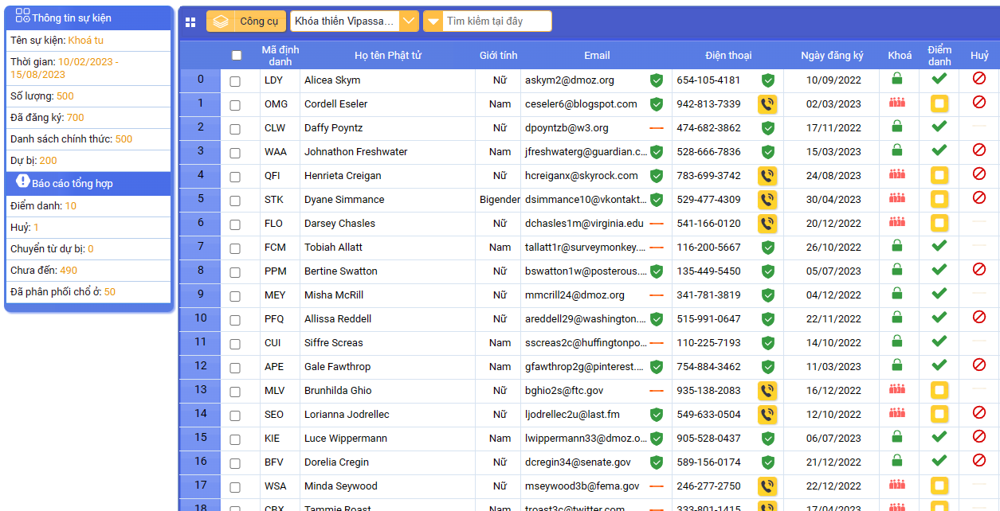

# CRM DASHBOARD

TUMMO CRM DASHBOARD is a template dasboard for web app.

A CRM dashboard wireframe serves as a blueprint, outlining key features and layout, facilitating the development of CRM webapp management tools.

[DEMO HERE]([https://](https://tummosoftware.com/)https://)

**TO DO LIST**

Datagridview

Calendar (support lunar calendar)

Textbox

Button

Cobobox

Listview

Menu

Toolbar

Checklistbox

DateTimePicker

File Manager

Dialog

Layout

Notify dialog

Checkbox

Progress bar

Property grid

Tab control

Treeview

Search box
